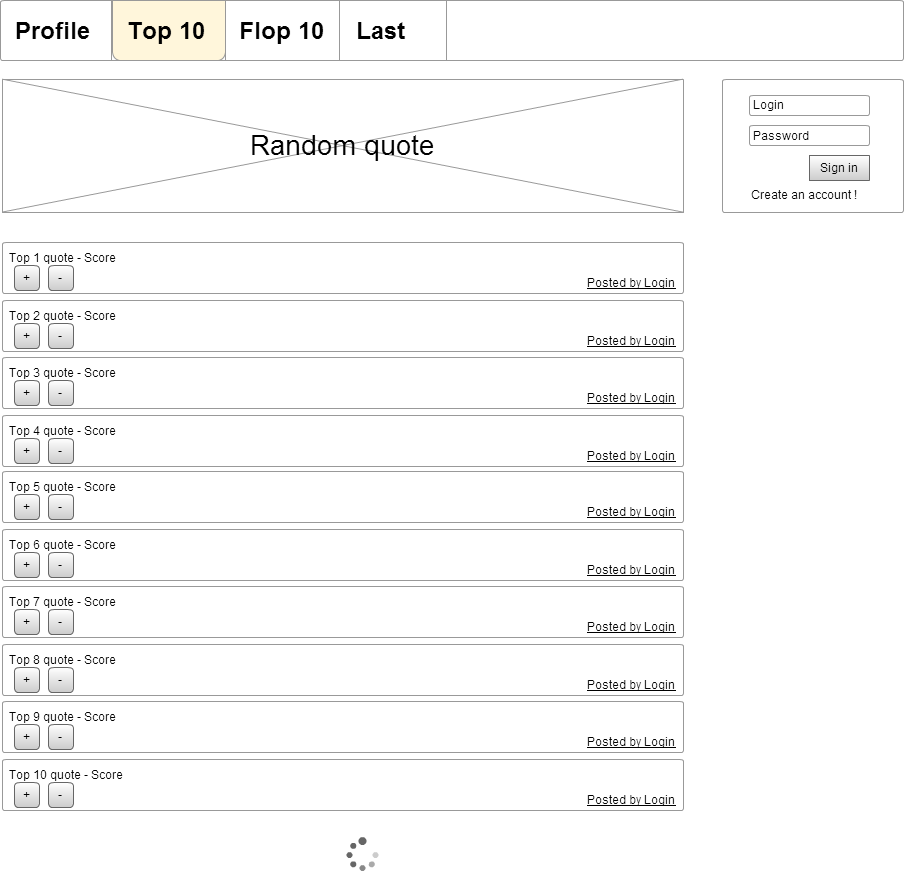

# Test task Kameleoon

## Task
Kameleoon Trial Task
You should implement a REST API for the web interface in the two wireframes below.

Quote List Quote Detail

Project requirements:  

* source code should be published on https://github.com/;  
* Docker image should be published on https://hub.docker.com/;  
* project should have docker-compose.yaml for local deploy, OR you can deploy it on a public hosting provider (Heroku, etc);
* use any in-memory database (Derby, H2, SQLite);  
* use Java and Spring Boot.  

The API should allow:  

* creation of a user account (deletion and other CRUD operations not requested). User properties are name, email, password and date of creation;  
* addition, viewing (including a method to get a random quote), modification, and deletion of quotes (real deletion from the database, not just via an archive flag). Quote properties include content, date of creation / update, link to user who posted it, link to votes;  
* voting on quotes (either upvote or downvote);  
* view of the top and worse 10 quotes, the details of each quote, and ideally a graph of the evolution of the votes over time.  
Not requested: frontend part, authentication mechanism, and account rights management.  

If you have some questions about business logic not covered here, you can choose yourself the answer, no need to ask us. At this point, the goal is to evaluate your coding skills, not how you respect a technical specification (this is also important, but can come later :-).

The full exercise can take about 6-8 hours (for a middle-level developer; longer for a junior) but the goal is not necessarily to do everything. You need to show your development skills, respect of best practices, understanding of the web development model (client, server), ability to deliver your work to a production-like environment, and your productivity.

## Result
Suported requests:  

Post ("/api/users") -  add user  
Get ("/api/users") -  get all users  
Post ("/api/quotes") -   add quote  
Get("/api/quotes/{id}") -  get quote by id  
Delete("/api/quotes/{id}") -  delete quote by id    
Get("/api/getRandomQuote") -    get random quote   
Put("/api/quotes") -  change quote  
Put("/api/quotes/vote") -  vote
Get("/api/getTop10") -  get top 10 quotes  
Get("/api/getWorse10") -  get worse 10 quotes  

